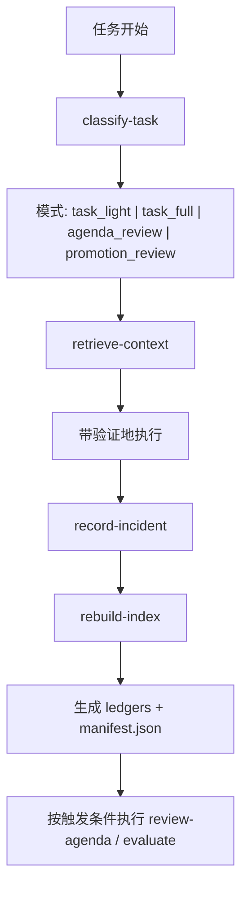

# self-evolving-agent
[](./README.md)
[](./README.zh-CN.md)

[](./SKILL.md)
[](https://github.com/RangeKing/self-evolving-agent/actions/workflows/ci.yml)
[](./LICENSE)
[](https://github.com/RangeKing/self-evolving-agent/stargazers)
[](./benchmarks/suite.json)
[](./system/coordinator.md)

🧠 self-improving-agent 只会记录错误。

`self-evolving-agent` 是一个面向 OpenClaw 的 phase-aware capability-evolution runtime。它会把任务路由到 `task_light`、`task_full`、`agenda_review` 或 `promotion_review` 模式；只检索最相关的历史 records；把新证据写入 canonical records；再自动重建人类可读的 ledgers 和 `manifest.json`。

它保留了 [`self-improving-agent`](https://github.com/peterskoett/self-improving-agent) 的优点，但把范式从下面三件事彻底升级了：

- incident logging -> capability evolution
- passive memory -> active learning agenda
- correction archive -> curriculum + evaluation + promotion gate

## ✨ 为什么存在

传统 self-improving agent 往往停在：

- “出错了”
- “把修正记下来”
- “写成一条规则”

这能减少重复犯错，但回答不了更关键的问题：

- agent 现在到底稳定会什么？
- 真正薄弱的是哪项能力？
- 下一步应该练什么？
- 这条经验只是被记录了，还是已经学会了？
- 这套策略能不能迁移到别的任务？

`self-evolving-agent` 的目标，就是把这些问题显式化。

## 📊 self-evolving-agent vs self-improving-agent

| 维度 | `self-improving-agent` | `self-evolving-agent` |
| --- | --- | --- |
| 主模式 | 被动纠错 | 目标驱动的能力进化 |
| 核心单位 | incident、error、note | capability、training unit、evaluation state |
| 记忆模型 | learnings 与 recurring issues | learnings + capability map + learning agenda |
| 任务前行为 | 如有需要回顾历史笔记 | 回顾历史、能力风险与当前训练重点 |
| 任务后行为 | 记录错误与经验 | 诊断最弱能力、更新能力图谱、刷新 agenda、必要时生成训练 |
| 重复问题处理 | 识别 recurring pattern | 将重复弱点转成带通过条件的训练单元 |
| 学习状态 | 大多隐式 | `recorded -> understood -> practiced -> passed -> generalized -> promoted` |
| promote 规则 | 有价值就 promote | 只有验证通过且可迁移才 promote |
| 迁移意识 | 较弱 | promote 前必须显式检查 transfer |
| 优化目标 | 少重复犯错 | 更独立、更稳定、更可迁移、更擅长陌生任务 |

## 🚀 核心亮点

- 🧭 **Learning agenda：** 同时只保留 1-3 个最高杠杆的训练重点
- 🗺️ **Capability map：** 跟踪等级、证据、边界、失败模式与升级条件
- 🧠 **Phase-aware control plane：** 先做模式路由，用最小安全模式处理任务，而不是默认每次都跑完整重流程
- 🗂️ **Canonical records：** 可变状态存放在 `records/` 下，人类阅读用 ledger 由 records 自动生成
- 🔬 **Diagnosis layer：** 把 incident 提升为能力层根因分析
- 🏋️ **Curriculum layer：** 生成 drills、pass criteria 和 transfer scenarios
- ✅ **Evaluation ladder：** 区分“写下来”和“真正学会了”
- 🔒 **Promotion gate：** 防止一次性经验污染长期策略
- 🤝 **Memory retention：** 保留经典错误、经验、feature request 记录能力

## 🧱 架构总览



运行时入口是 [`scripts/evolution_runtime.py`](./scripts/evolution_runtime.py)。它把 `assets/records/` 和工作区里的 `records/` 目录视为可变的 source of truth，并自动生成 summaries 与 `index/manifest.json`。

## 🔁 Phase-Aware Loop

每个有意义的 cycle 都遵循这个控制面：

1. 用 `scripts/evolution_runtime.py classify-task` 分类任务
2. 选择最小但足够安全的模式
3. 用 `retrieve-context` 只拉取该模式需要的 records
4. 按该模式要求带验证地执行
5. 用 `record-incident` 写入可复用证据
6. 用 `rebuild-index` 重建 `records/` 视图和 `manifest.json`

任务闭环之外，只在触发条件满足时运行 `review-agenda` 和 `evaluate`。

## 🧩 它保留了 self-improving-agent 的什么

- 错误记录
- learning capture
- feature request 记录
- recurring pattern 检测
- 重大任务前回顾历史经验
- 向长期上下文 promote
- hook-friendly 的工作方式

这些能力都还在，但它们现在只是 **memory layer**，而不是整个系统。

## 🔄 从 self-improving-agent 迁移

最常见的冲突其实不是数据丢失，而是两套提醒同时生效。

如果用户已经装过 `self-improving-agent`，推荐的无痛迁移路径是：

1. 先安装 `self-evolving-agent`，不要急着删除旧 skill。
2. 初始化 `.evolution/` 时，把旧的 `.learnings/` 一并导入。
3. 把导入后的内容保存在 `.evolution/legacy-self-improving/`，作为只读历史层。
4. 确认导入成功后，再关闭旧的 `self-improvement` hook。
5. 只有当某条旧经验再次被检索到、进入 agenda、参与 evaluation 或 promotion 时，才逐步规范化到新 schema。

这样可以保留旧经验，又不会为了“一次性转格式”引入有损迁移。

示例：

```bash
~/.openclaw/skills/self-evo-agent/scripts/bootstrap-workspace.sh \
  ~/.openclaw/workspace/.evolution \
  --migrate-from ~/.openclaw/workspace/.learnings
openclaw hooks disable self-improvement
openclaw hooks enable self-evolving-agent
```

## 🎯 最适用的场景

如果你希望 agent：

- 能跨 session 持续进化
- 在陌生任务上更稳
- 把重复失败转成刻意训练
- 明确区分“记录”与“掌握”
- 先证明迁移，再沉淀长期策略

那么这个 skill 就是为这种目标设计的。

## ⚖️ 模式说明

`task_full` 不应该为了每一个小失误都全量启动。

当任务熟悉、低后果、短链路时，优先使用 `task_light`：只检索少量最相关 records，提前说清一个风险点和一个验证动作，不要顺手展开 agenda 或 promotion 工作。

当任务陌生、后果较高、命中当前 agenda 重点、出现重复模式、用户不得不 rescue，或者这条经验已经值得进入 training / evaluation 时，才升级为 `task_full`。

只有在“5 个 meaningful cycles 后”“结构性缺口出现”“transfer 失败”“即将开始新的陌生项目”等场景下，才进入 `agenda_review`。

只有在做 transfer / promotion 判断时，才进入 `promotion_review`。

## 📁 仓库结构

```text
self-evolving-agent/
├── SKILL.md
├── README.md
├── README.zh-CN.md
├── install.md
├── agents/
│   └── openai.yaml
├── benchmarks/
│   ├── suite.json
│   └── schemas/
│       └── judge-output.schema.json
├── system/
│   └── coordinator.md
├── modules/
│   ├── capability-map.md
│   ├── curriculum.md
│   ├── diagnose.md
│   ├── evaluator.md
│   ├── learning-agenda.md
│   ├── promotion.md
│   └── reflection.md
├── assets/
│   ├── records/
│   │   ├── agenda/
│   │   └── capabilities/
│   ├── CAPABILITIES.md
│   ├── ERRORS.md
│   ├── EVALUATIONS.md
│   ├── FEATURE_REQUESTS.md
│   ├── LEARNING_AGENDA.md
│   ├── LEARNINGS.md
│   └── TRAINING_UNITS.md
├── evals/
│   └── evals.json
├── demos/
│   ├── demo-1-diagnosis.md
│   ├── demo-2-training-loop.md
│   ├── demo-3-promotion-and-transfer.md
│   ├── demo-4-agenda-review.md
│   └── demo-5-pre-task-risk-diagnosis.md
├── hooks/
│   └── openclaw/
│       ├── HOOK.md
│       └── handler.ts
└── scripts/
    ├── activator.sh
    ├── bootstrap-workspace.sh
    ├── evolution_runtime.py
    ├── error-detector.sh
    ├── run-benchmark.py
    └── run-evals.py
```

## ⚡ 快速开始

1. 把 skill 安装到 OpenClaw skills 目录
2. 初始化持久化 `.evolution` 工作区
3. 先通过 runtime 分类任务，并只检索所需 records
4. 通过 runtime 在 canonical record 更新后自动重建 ledgers 与 `manifest.json`
5. 跑 benchmark 看这个 skill 在真实模型执行下的表现

```bash
cp -r self-evolving-agent ~/.openclaw/skills/self-evo-agent
~/.openclaw/skills/self-evo-agent/scripts/bootstrap-workspace.sh ~/.openclaw/workspace/.evolution
python3 ~/.openclaw/skills/self-evo-agent/scripts/evolution_runtime.py classify-task \
  --workspace ~/.openclaw/workspace/.evolution \
  --prompt "I need to modify a production deployment workflow I have never touched before."
python3 ~/.openclaw/skills/self-evo-agent/scripts/run-evals.py ~/.openclaw/skills/self-evo-agent
python3 ~/.openclaw/skills/self-evo-agent/scripts/run-benchmark.py --skill-dir ~/.openclaw/skills/self-evo-agent
```

更完整的安装说明见 [install.md](./install.md)。

## 📦 安装方式

### 方式 A：通过 ClawHub 安装

适合希望直接通过 registry 安装到当前 OpenClaw workspace 的场景。

```bash
npm i -g clawhub
# 或
pnpm add -g clawhub

clawhub install RangeKing/self-evo-agent
```

安装后请重启一个新的 OpenClaw session，让它从 workspace 的 `skills/` 目录重新加载。
Registry slug 和本地目录使用 `self-evo-agent`，但 skill 名和 hook 名仍然是 `self-evolving-agent`。
如果你之前已经在用 `self-improving-agent`，建议先导入 `.learnings/`，再关闭旧 hook。

### 方式 B：让 OpenClaw 自己从 GitHub 下载并安装

如果你希望让 agent 自己从 GitHub 仓库拉取 skill，可以直接对 OpenClaw 说：

```text
Install the OpenClaw skill from https://github.com/RangeKing/self-evolving-agent into ~/.openclaw/skills/self-evo-agent, inspect the scripts before enabling hooks, and then bootstrap ~/.openclaw/workspace/.evolution.
```

这种方式适合把它作为共享 managed skill 安装到 `~/.openclaw/skills`。

### 方式 C：手动 Git clone

```bash
git clone https://github.com/RangeKing/self-evolving-agent.git ~/.openclaw/skills/self-evo-agent
~/.openclaw/skills/self-evo-agent/scripts/bootstrap-workspace.sh ~/.openclaw/workspace/.evolution
```

如果你已有 `~/.openclaw/workspace/.learnings`，推荐改用：

```bash
~/.openclaw/skills/self-evo-agent/scripts/bootstrap-workspace.sh \
  ~/.openclaw/workspace/.evolution \
  --migrate-from ~/.openclaw/workspace/.learnings
```

### 安全提示

ClawHub 是公开 registry，skills 本质上属于受信任的本地代码。启用 hooks 或运行 benchmark 脚本前，建议先审阅仓库或安装后的文件内容。

## 🤝 项目健康

- 贡献指南：[CONTRIBUTING.md](./CONTRIBUTING.md)
- 变更记录：[CHANGELOG.md](./CHANGELOG.md)
- 安全策略：[SECURITY.md](./SECURITY.md)
- 开源许可证：[MIT](./LICENSE)

## 🧪 Benchmark

仓库里提供两类评测：

- `scripts/run-evals.py`
  - 结构化合规检查，确保模块、文件与 benchmark 资产完整
- `scripts/run-benchmark.py`
  - 真实 model-in-the-loop benchmark
  - 会保存 candidate prompt、raw events、final output、judge output 和 report

示例 smoke run：

```bash
python3 scripts/run-benchmark.py \
  --skill-dir . \
  --candidate-model gpt-5.4-mini \
  --judge-model gpt-5.4-mini \
  --max-scenarios 1 \
  --timeout-seconds 90
```

## 🧭 用途示例

- 把会自纠错的 agent 升级成会自训练的 agent
- 把 postmortem 从“记笔记”升级成“产出训练”
- 搭建不会把“记录”误当“掌握”的 agent memory system
- 评估 agent 是否真的能跨任务迁移策略
- 为 research、coding、verification、operations 等工作流设计 curriculum

## 🛣️ Roadmap

- [x] Memory / diagnosis / curriculum / evaluator / reflection / promotion 模块
- [x] Capability bootstrap map 与 proactive learning agenda
- [x] Model-in-the-loop benchmark harness
- [ ] 增加更多 coding、research、long-horizon 场景 benchmark
- [ ] 支持多次 benchmark run 的趋势汇总
- [ ] 提供不同 agent 域的 workspace 示例包
